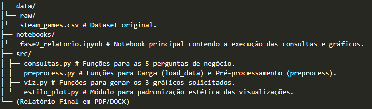

# FunCorpSteamAnalysis---ProjetoParte2

# 🚀 Projeto Final - Fase 2: Análise de Dados da Plataforma Steam

Este repositório contém os códigos, dados e o relatório final da **Fase 2 da disciplina de Programação para Dados**. O objetivo principal é realizar uma Análise Exploratória de Dados (EDA) sobre um dataset de jogos da plataforma Steam para responder a perguntas de negócio específicas e gerar visualizações que apoiem a tomada de decisão da empresa fictícia  *Fun Corp*.

## 📋 Estrutura do Repositório

O projeto está organizado em módulos Python dentro da pasta `src/` para manter a modularidade do pipeline de ETL (Extração, Transformação e Carga), como no exemplo abaixo:



## 🛠️ Requisitos e Configuração

Para executar o `fase2_relatorio.ipynb` e as funções de análise, é necessário ter as seguintes bibliotecas Python instaladas:

```bash
pip install pandas matplotlib numpy collections ipykernel

